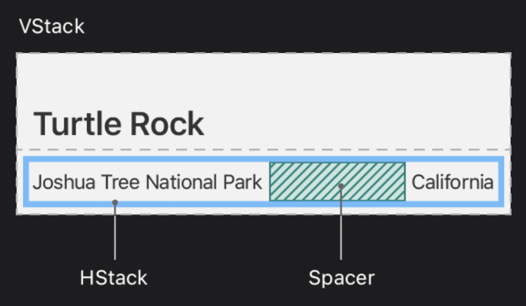
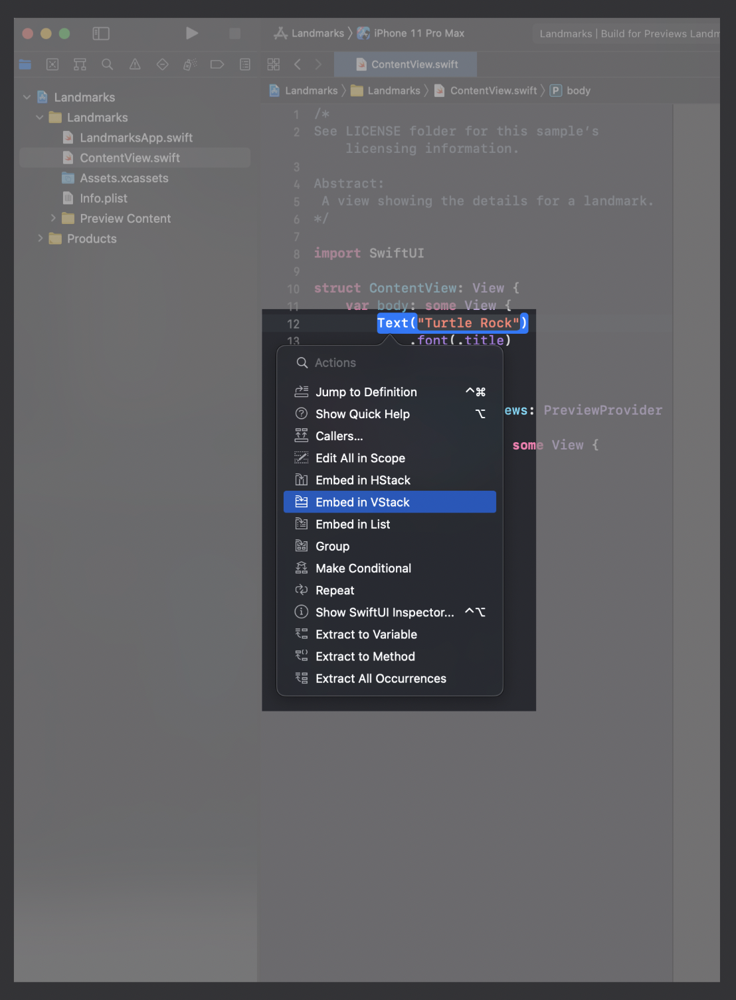
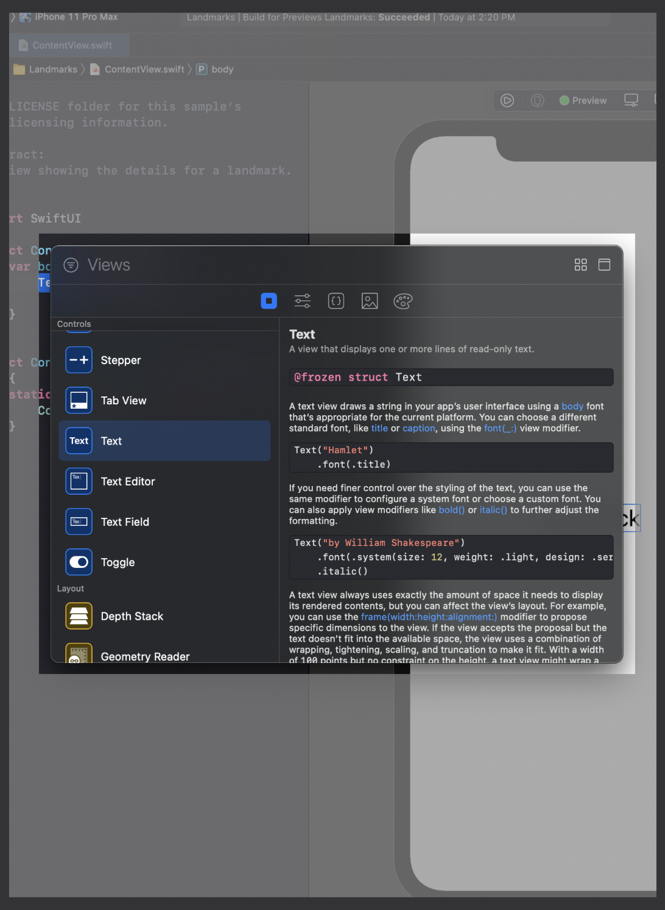
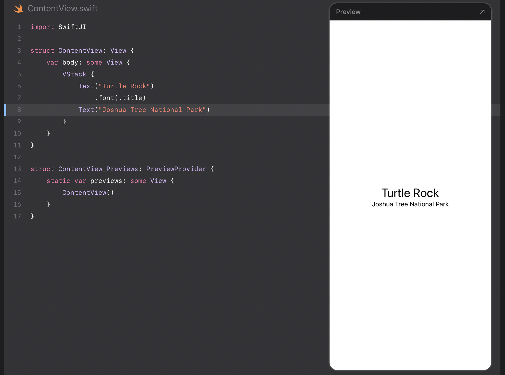
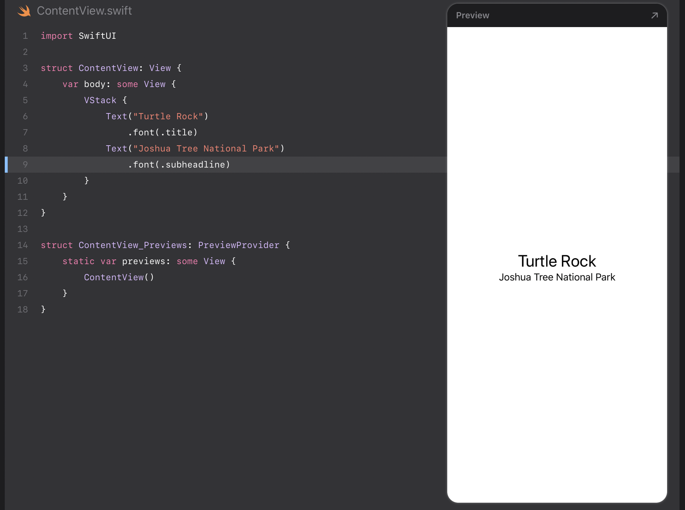
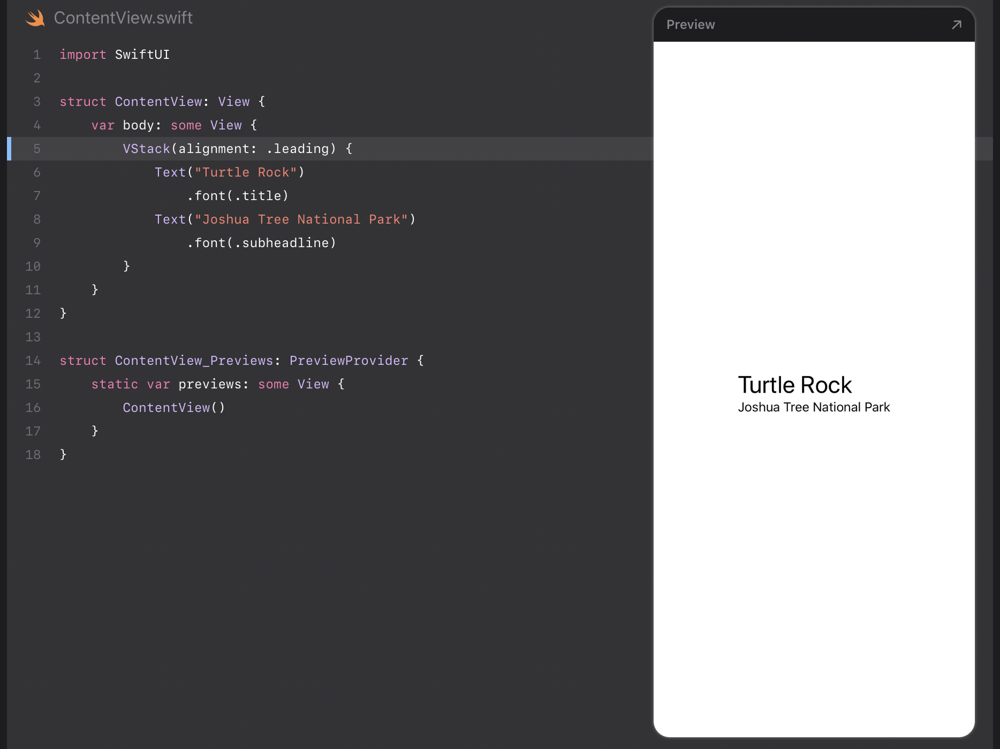
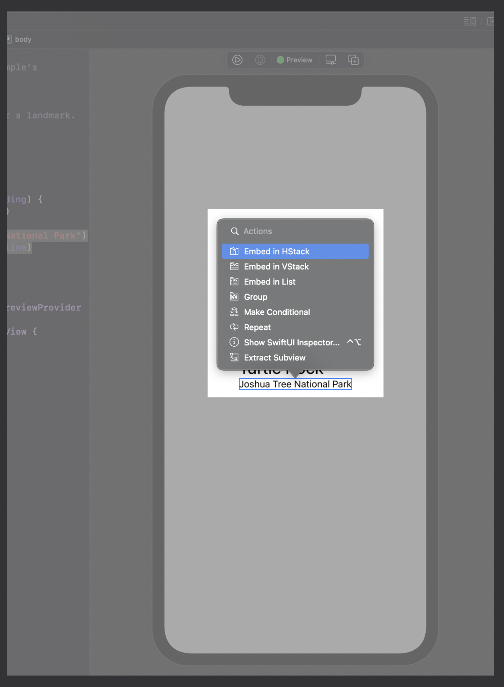
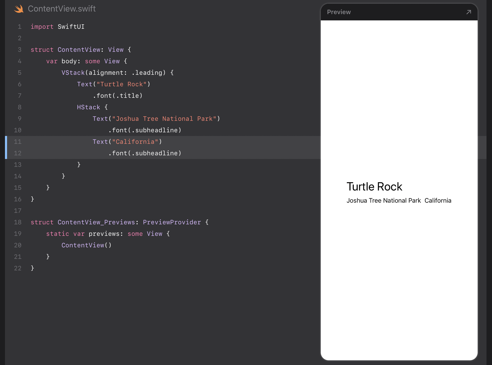
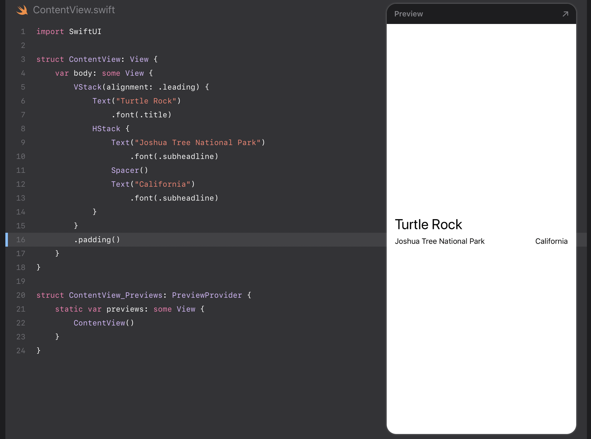

### SwiftUI의 필수요소들

# view 만들고 합치기

본 tutorial은 _Landmarks_ 라는 좋아하는 장소를 발견하고 공유하기 위한 앱을 구축하는 과정을 안내합니다. 당신은 랜드마크의 세부사항을 보여주는 view를 구축하는 것으로부터 시작할 것입니다.

view를 배치하기 위해, Landmarks앱은 stack을 사용하여 image와 text view 컴포넌트를 결합하고 계층화 합니다. view에 지도를 추가하기 위해, 당신은 기본적인 MapKit 컴포넌트를 추가할 것입니다. 당신이 이렇게 view의 디자인을 가공할 때, Xcode가 실시간으로 피드백을 제공하기 때문에 변경사항이 코드로 어떻게 변환되는지 볼 수 있습니다.

프로젝트의 구축을 시작하기 위해 프로젝트 파일을 다운로드 하고, 아래의 단계를 따라가세요.

| 예상 소요시간 |                                                           프로젝트 파일                                                           |                              13.1 이상의 Xcode                               |
| :-----------: | :-------------------------------------------------------------------------------------------------------------------------------: | :--------------------------------------------------------------------------: |
|     40분      | [프로젝트 파일](https://docs-assets.developer.apple.com/published/9637262be4dfa3661d596e567d0c793f/CreatingAndCombiningViews.zip) | [13.1 이상의 Xcode](https://itunes.apple.com/us/app/xcode/id497799835?mt=12) |

 

### 목차

- [Section 1. 새로운 Project를 만들고 Canvas 살펴보기](#section-1)
- [Section 2. Text View 커스텀하기](#section-2)
- [Section 3. stack 사용하여 view들 합치기](#section-3)

 

### Section 1

## 새로운 Project를 만들고 Canvas 살펴보기

SwiftUI를 사용하는 새 Xcode 프로젝트를 만듭니다. 만든 후 canvas, previews 그리고 SwiftUI의 템플릿 코드를 살펴보세요.

Xcode의 canvas에서 view를 미리보고 상호작용하고, tutorials에 서술되어있는 모든 최신기능을 사용하려면, 당신의 Mac의 maxOS버전이 macOS Monterey 이상인지 확인하세요.

 

### Step 1

Xcode를 열고 Xcode 시작 화면에 있는 "Create a new Xcode project"를 클릭하거나, File > New > Project를 선택하세요.

 

### Step 2

template 선택기에서, 플랫폼으로 iOS를 선택하고, App template을 선택한 뒤, Next를 클릭하세요.

 

### Step 3

product name에 "Landmarks"를 입력하고, interface로 "SwiftUI"를 선택한 뒤, language로 "Swift"를 선택한 뒤 Next를 클릭하세요. 다음으로 Landmarks 프로젝트를 저장할 위치를 고르세요.

 

### Step 4

프로젝트 navigator에서 LandmarksApp.swift를 선택하세요.

SwiftUI 앱 life cycle을 이용하는 앱은 App protocol을 준수하는 구조를 가지고 있습니다. 구조의 body 속성은 하나 이상의 scene을 반환하고, 차례로 표시할 컨텐츠를 제공합니다. @main 속성은 앱의 진입점을 식별합니다.

 

### Step 5

프로젝트 navigator에서 ContentView.swift를 선택하세요.

기본적으로, SwiftUI의 view 파일은 두 개의 구조를 선언합니다. 첫 번째 구조는 view의 protocol을 따르고 view의 content와, layout을 설명합니다. 두 번째 구조는 해당 보기에 대한 미리보기를 선언합니다.

 

### Step 6

canvas에서 Resume을 클릭해 preview를 띄우세요.

**Tip.** 만일 canvas가 보이지 않는다면, Editor > Canvas를 선택하면 보입니다.

 

### Step 7

body 속성에서, "Hello, World!"를 수정해 스스로를 환영해보세요.

view의 body 속성에서 코드를 변경하면, preview가 당신의 수정사항을 반영해서 업데이트합니다.

 

### [⇡목차로 돌아가기](#목차)

 

### Section 2

## Text View 커스텀하기

당신은 코드를 변경해 view의 display를 변경하거나, inspector를 이용해 사용가능한 항목을 찾음으로서 코드작성에 도움을 받을 수 있습니다.

Landmarks 앱을 만들면서, 당신은 source 편집기, canvas, inspector와 같은 편집기들을 마음대로 조합해 사용할 수 있습니다. 당신이 어떤 도구를 사용하든지에 관계없이 코드는 업데이트된 상태로 유지됩니다.

 

> 다음으로 당신은 inspector를 이용해 text view를 커스텀해볼 것 입니다.

 

### Step 1

preview에서 환영문구를 `commamd + 클릭` 해서 구조화된 editing popover를 가져오고, "Show SwiftUI Inspector" 를 선택하세요.

popover는 당신이 inspect하려고 선택한 view의 타입에 따라, 커스텀이 가능한 다른 속성들을 보여줍니다.

 

### Step 2

inspector를 이용해 text를 "Turtle Rock"으로 변경하세요, 이는 당신이 app에서 보여줄 첫 번째 랜드마크의 이름입니다.

 

### Step 3

font modifier를 "Title"로 변경하세요.

이렇게 text에 system font를 적용함으로서 사용자가 선호하는 font size와 setting이 올바르게 적용됩니다.

 

> SwiftUI의 view를 커스텀하기 위해 당신이 부르는 method를 modifier라고 부릅니다. modifier는 view의 display 또는 다른 속성들을 변경하기위해 view를 감싸고 있습니다. 각각의 modifier는 새로운 view를 반환하므로, 수직으로 여러 modifier를 쌓아 연결하는 것이 일반적인 방법입니다.

 

### Step 4

code를 직접 수정해서 `padding()` modifier를 `foregroundColor(.green)` modifier로 변경하세요; 이 변경사항은 text의 색상을 green으로 바꿉니다.

 

> 당신의 코드는 항상 view와 동일한 source 입니다. 당신이 inspector를 이용해 modifier를 변경 또는 제거하면, Xcode는 이를 당신의 code에도 즉시 일치시킵니다.

 

### Step 5

이번에는, code editor의 `Text` 선언부에서 `Command + 클릭`을 통해 inspector를 열고, popover에서 "Show SwiftUI Inspector"를 선택하세요. 이후 Color 팝업 메뉴를 클릭하고 `Inherited` 를 선택해서 text color를 다시 black으로 바꾸세요.

 

### Step 6

`foregroundColor(.green)` modifier가 변경, 삭제 될 때 Xcode에 의해 당신의 code가 자동으로 반영된다는 점을 기억하세요.

 

### [⇡목차로 돌아가기](#목차)

 

### Section 3

## stack 사용하여 view들 합치기

당신은 이전 섹션에서 만들었던 title view 외에, 도시와 공원의 이름과 같은 랜드마크에 대한 세부정보를 담을 text view들을 추가할 것입니다.

SwiftUI view를 만들게 될 때, 당신은 해당 view의 content, layout, behavior를 view의 body 속성 내부에 서술할 것입니다; 그러나, body 속성은 오직 하나의 view를 리턴합니다. 당신은 여러 view들을 그룹화하여 수직, 수평으로 배치하거나 앞뒤로 배치하는 stack을 통해 view들을 합치거나, 포함시킬 수 있습니다.

이번 섹션에서, 당신은 공원의 세부사항을 담은 horizontal stack을 구현하고 vertical stack을 이용해 title 아래에 해당 horizontal stack을 배치해볼 것입니다.

 

> 당신은 Xcode의 structured editing support를 이용해 container view에 view를 포함시키거나, inspector를 열거나, 다른 유용한 변경사항을 도울 수 있습니다.

 

### Step 1

`Text` view의 initializer를 `command + 클릭`해 structured editing popover를 보이게 하고, "Embed in VStack" 을 선택하세요.

 

> 다음으로, 당신은 library에서 Text view를 드래그해서 stack에 text view를 추가할 것입니다.

 

### Step 2

Xcode 창의 우상단에 있는 플러스 버튼 (+) 을 클릭해서 library를 열고, "Turtle Rock" text view 바로 아래에 `Text` view를 드래그해서 위치시키세요.

 

### Step 3

`Text` view의 placeholder를 “Joshua Tree National Park”로 변경하세요.

 

> 원하는 레이아웃과 일치하도록 location을 커스텀합니다.

 

### Step 4

location의 font를 subheadline으로 설정합니다.

 

### Step 5

`VStack` initializer edge의 align을 leading에 맞추도록 편집합니다.

기본적으로, stack은 content를 중앙에 배치하도록 axis가 맞춰져 있고 상황에 맞춘 spacing을 제공합니다.

 

> 다음으로, 공원의 지역을 넣을 text view를 location의 우측에 추가할 것입니다.

 

### Step 6

canvas에서, "Joshua Tree National Park"을 `command + 클릭`하고, “Embed in HStack”을 선택합니다.

 

### Step 7

location 다음에 새로운 `Text` view를 추가하고, placeholder를 공원의 지역으로 변경한 뒤, text view의 font를 subheadline으로 설정합니다.

 

### Step 8

디바이스의 전체 width를 사용하는 layout을 지시하려면, 두 개의 text view를 가진 horizontal stack에 `Spacer` 를 추가해 공원과 지역을 분리합니다.

`Spacer` 는 content에 의해서만 크기가 정의되는 대신에, 포함된 view가 부모 view의 모든 공간을 사용하도록 확장합니다.

 

### Step 9

마지막으로, `padding()` modifier method를 이용해 랜드마크의 이름과 세부사항에 약간의 여백을 줍니다.

 

### [⇡목차로 돌아가기](#목차)

 
