### SwiftUI의 필수요소들

# List와 Navigation 만들기

기본적인 landmark detail view가 설정된 후, 각각의 location에 대한 detail view로 갈 수 있는 길인, landmark의 모든 list를 제공할 필요가 있습니다.

어떤 landmark든 정보를 볼 수 있도록 view를 만들고, 동적으로 생성되는 scrolling list를 만들어 user가 tap을 통해 landmark의 detail view를 볼 수 있도록 할 것입니다. UI를 미세 조정하기 위해, 각기다른 device size의 preview를 Xcode의 canvas에 여러개 렌더링 할 것입니다.

프로젝트의 구축을 시작하기 위해 프로젝트 파일을 다운로드 하고, 아래의 단계를 따라가세요.

| 예상 소요시간 |                                                           프로젝트 파일                                                            |                              13.1 이상의 Xcode                               |
| :-----------: | :--------------------------------------------------------------------------------------------------------------------------------: | :--------------------------------------------------------------------------: |
|     35분      | [프로젝트 파일](https://docs-assets.developer.apple.com/published/58c23eda8649a103c25ce8f2b8d7547a/BuildingListsAndNavigation.zip) | [13.1 이상의 Xcode](https://itunes.apple.com/us/app/xcode/id497799835?mt=12) |

 

### 목차

- [Section 1. Landmark Model 만들기](#section-1)

 

### Section 1

## Landmark Model 만들기

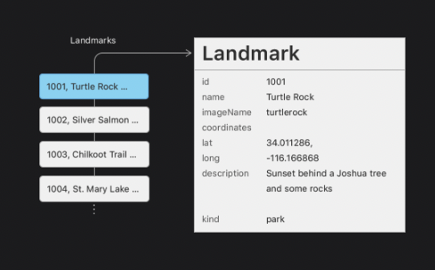

첫번째 tutorial로, 당신은 모든 custom view에 정보를 하드코딩 했었습니다. 여기에서는, view에 전달할 수 있도록 data를 저장할 model을 만들 것입니다.

이전 tutorial에서 완성한 project와 이번 tutorial project 파일 중 이용할 수 있는 resource들을 이용해 시작하세요.

 

### Step 1

다운로드한 파일의 Resource 폴더에서 landmarkData.json 을 당신의 project의 navigation 영역에 드래그하세요; dialog가 나타나면, "Copy items if needed" 를 선택하고 target으로 Landmarks를 지정한 후, Finish를 클릭하세요.

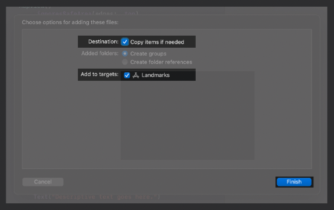

tutorial의 나머지 부분과, 이후 모든 곳에서 이 sample data를 이용할 것입니다.

 

### Step 2

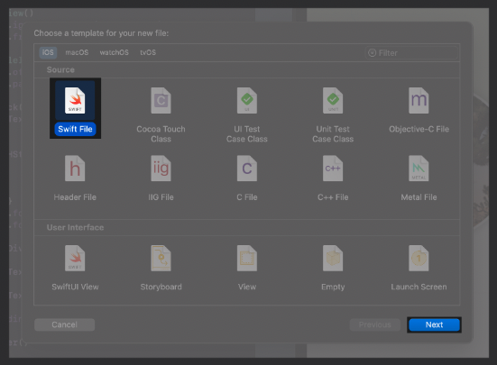

File > New > File을 선택해 project에 새로운 Swift 파일을 생성하세요, 그리고 이름을 Landmark.swift로 지으세요.

 

### Step 3

landmarkData.json 데이터 파일의 몇몇 key들과 property의 이름이 매칭되도록 Landmark structure를 정의하세요.

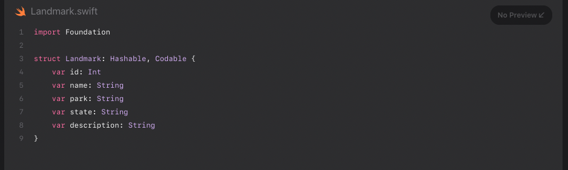

Codable을 채택하면 structure와 data 파일 사이에서 data가 더 쉽게 이동할 수 있습니다. 이 섹션의 뒷부분에서는 file로부터 data를 읽기 위해 Codable protocol의 Decodable 컴포넌트에 의존할 것입니다.

 

> 다음 몇 개의 step에서는 각각의 landmark에 연관된 image를 모델링할 것입니다.

 

### Step 4

project 파일의 Resource 폴더에 있는 JPG 파일들을 당신의 project의 asset catalog로 드래그하세요. Xcode는 각각의 image에 대해 새로운 image set을 생성합니다.

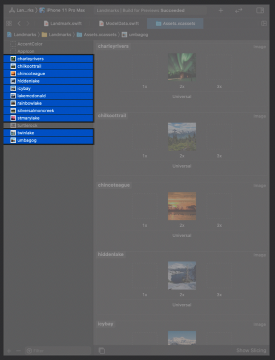

새 이미지들은 이전 tutorial에서 추가했던 Turtle Rock과 합류합니다.

 

### Step 5

data로부터 image의 이름을 읽기 위해 imageName property를 추가하고, asset catalog로부터 image를 load하는 image라는 computed property를 추가합니다.

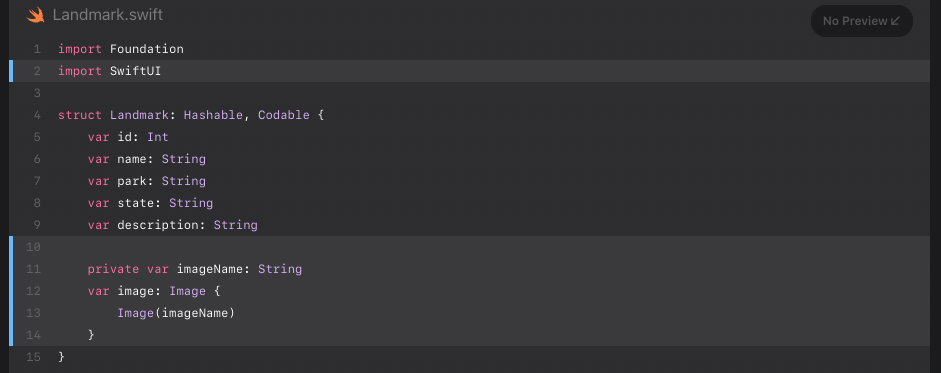

Landmark structure의 user는 image에만 관심을 가질 것이기 때문에 property는 private으로 설정합니다.

 

> 다음으로, landmark의 location에 대한 정보를 관리할 것입니다.

 

### Step 6

JSON data structure의 storage를 반영하는 중첩된 Coordinates 타입을 사용해 structure에 coordinates property를 추가하세요

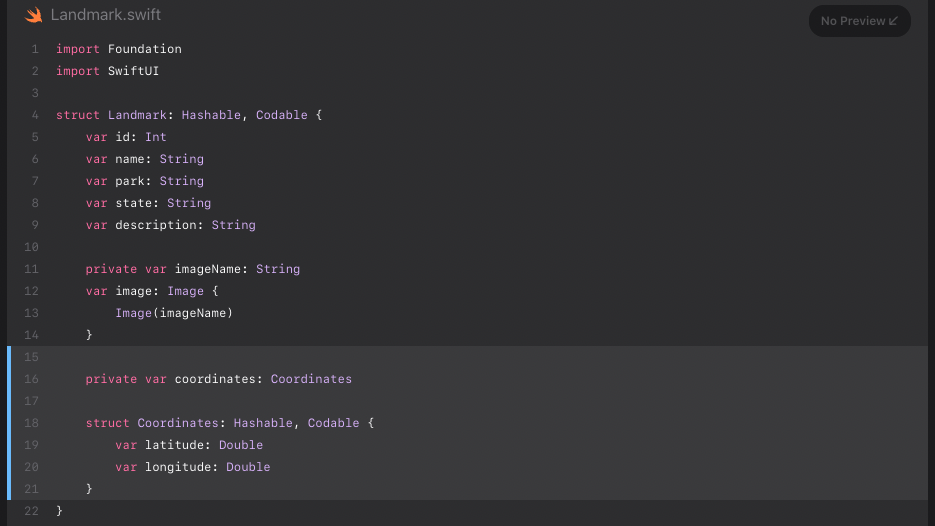

다음 step에서 만들 public computed property만 사용할 것이므로 이 property는 private으로 설정하세요.

 

### Step 7

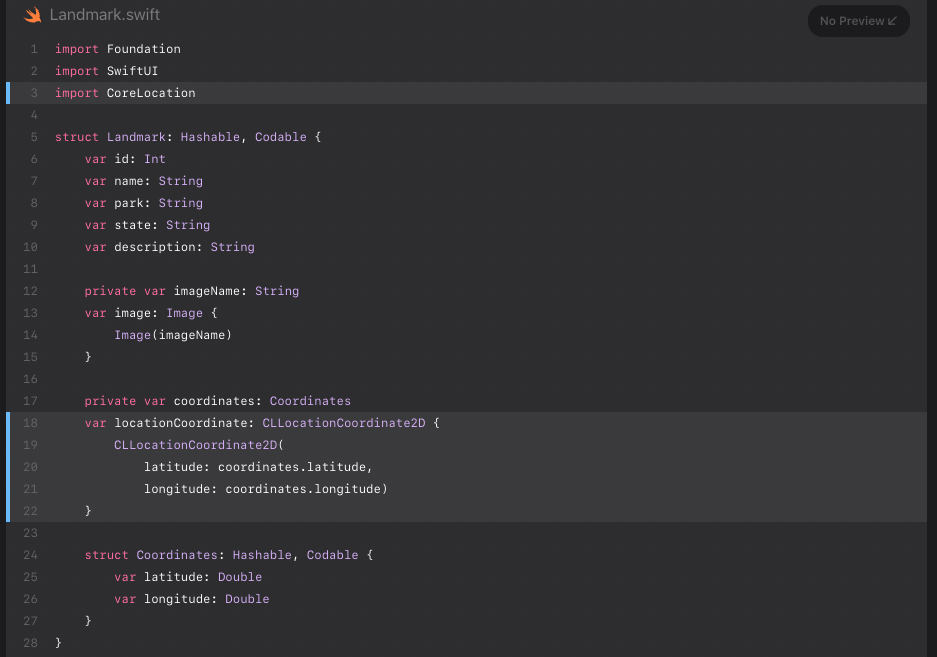

MapKit framework에서 상호작용하기 유용하게 locationCoordinate property를 가공하세요.

 

> 마지막으로, file의 landmark로부터 초기화한 array를 만들 것입니다.

 

### Step 8

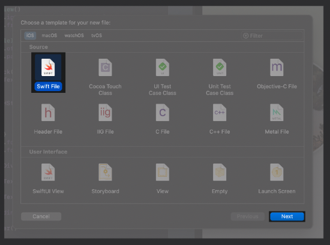

project에 ModelData.swift 라는 이름의 새 Swift file을 생성하세요.

 

### Step 9

app의 main bundle에서 주어진 이름의 JSON data를 fetch하는 method인 load(\_:)를 만듭니다.

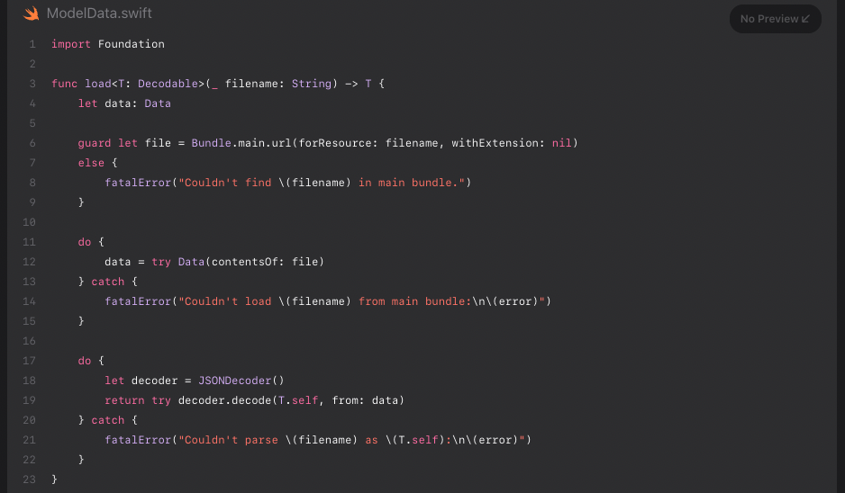

load method의 반환 type은 Codable protocol의 component 중 하나인 Decodable protocol을 준수하도록 의존됩니다.

 

### Step 10

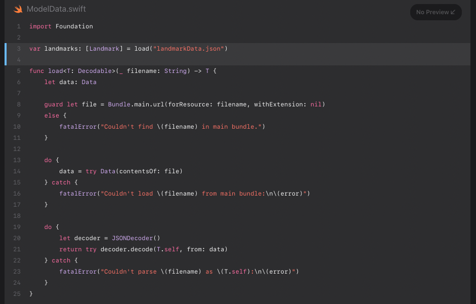

landmarkData.json 으로부터 초기화한 landmarks array를 만듭니다.

 

> 계속 진행하기 전에, 연관된 file들을 함께 그룹화하여 점점 커지는 project를 관리하기 쉽도록 합니다.

 

### Step 11

ContentView.swift, CircleImage.swift, MapView.swift를 Views 그룹에, landmarkData.json을 Resources 그룹에, Landmark.swift, ModelData.swift를 Model 그룹에 넣습니다.

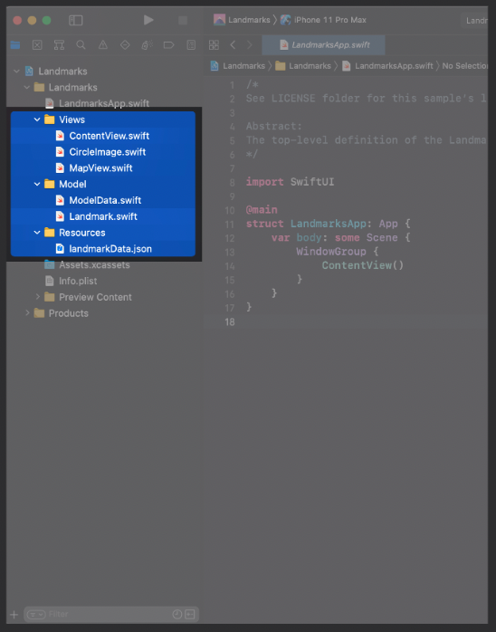

팁  
그룹에 추가할 이미 존재하는 item들을 고른 후, Xcode 메뉴에서 File > New > Group 을 선택해 그룹을 만들 수 있습니다.

 

### [⇡목차로 돌아가기](#목차)

 
