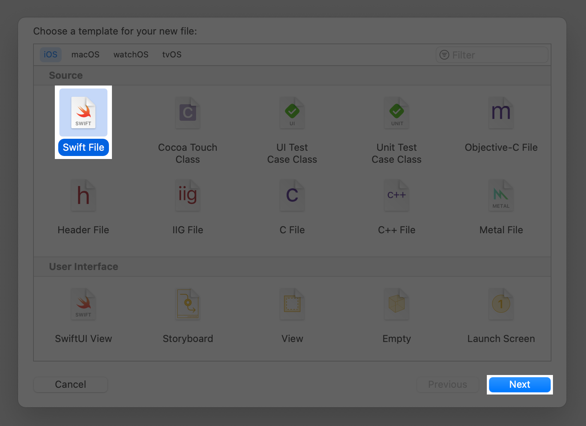
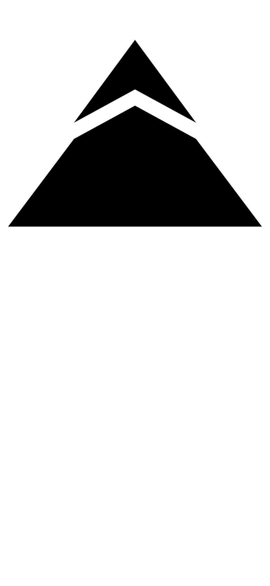
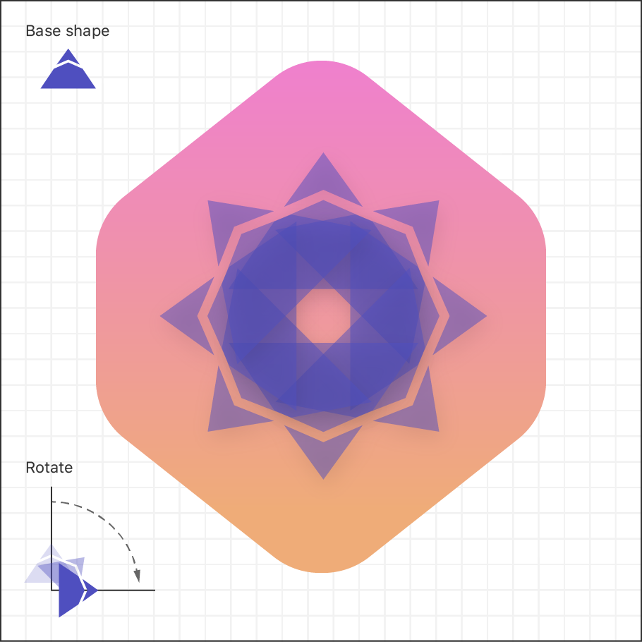

<table style="background-image: url(../images/chapter2/1-drawing-paths-and-shapes/040H00@2x.png); background-size: cover; background-position: top;">
<td width="60%">

### Drawing과 Animation

# Path와 Shape 그리기

사용자는 목록에 있는 랜드마크를 방문할 때마다 badge를 받습니다. 물론, 사용자가 badge를 받으려면 badge를 만들어야 합니다. 본 tutorial에서는 path와 shape를 결합하여 badge를 만들고, badge를 위치를 나타내는 다른 도형과 overay하는 과정을 안내합니다.

여러 종류의 랜드마크에 대해 여러 개의 badge를 만들려면, 겹쳐진 symbol로 실험하거나, 반복 횟수를 변경하거나, 각도와 비율을 다양하게 변경하세요.

이 프로젝트를 build하는 단계를 따르거나, 완료된 프로젝트를 다운로드하여 직접 탐색하세요.

| 예상 소요시간 |       프로젝트 파일      |           실습 환경            |
| :----------: | :---------------------: | :---------------------------: |
|     25분     | [다운로드][프로젝트 파일] | [13.1 이상의 Xcode][실습 환경] |

[프로젝트 파일]: https://docs-assets.developer.apple.com/published/e08d353171a36c3834ffec37760ab0cb/DrawingPathsAndShapes.zip
[실습 환경]: https://itunes.apple.com/us/app/xcode/id497799835?mt=12

</td>
<td>
</td>
</table>

<br>

### 목차

- [Section 1. Badge View에 대한 그리기 정보 만들기](#section-1)
- [Section 2. Badge 배경 그리기](#section-2)
- [Section 3. Badge Symbol 그리기](#section-3)
- [Section 4. Badge 전경과 배경 결합하기](#section-4)

<hr>
<br>

<table>

<tr>
<td width="40%">

### Section 1

## Badge View에 대한 그리기 정보 만들기

Badge를 만들려면, 먼저 badge의 배경에 대해 육각형 shape를 그리는 데 사용할 수 있는 정보를 정의해야 합니다.

</td>
<td width="40%">


</td>
</tr>

</table>

<br>

### Step 1



탐색 창에서 Views 그룹을 선택한 상태에서, File > New > File 을 선택하고, iOS Templates 시트에서 Swift File을 선택한 후, Next를 클릭하세요.

<br>

### Step 2


새 파일의 이름을 HexagonParameters.swift로 지으세요.

<br>

> 이 구조를 사용하여 육각형의 shape를 정의합니다.

<br>

### Step 3

> `HexagonParameters.swift`
> ```swift
>   import Foundation
>   
>   struct HexagonParameters {
>   }
> ```

새 파일 내에 HexagonParameters라는 구조체를 만듭니다.

<br>

### Step 4

> `HexagonParameters.swift`
> ```swift
> * import Foundation
>   
>   struct HexagonParameters {
> *     struct Segment {
> *         let line: CGPoint
> *         let curve: CGPoint
> *         let control: CGPoint
> *     }
>   }
> ```

육각형의 한 side를 나타내는 세 점을 잡는 Segment 구조체를 정의합니다. CGPoint를 사용할 수 있도록 CoreGraphics를 import하세요.

<br>

> 각 side는 이전 끝 지점에서 시작하고, 첫번째 지점으로 곧게 이동한 다음, 모서리에 있는 Bézier curve를 넘어 두번째 지점으로 이동합니다. 세번째 지점은 curve의 shape를 제어합니다.

<br>

### Step 5

> `HexagonParameters.swift`
> ```swift
>   import Foundation
>   
>   struct HexagonParameters {
>       struct Segment {
>           let line: CGPoint
>           let curve: CGPoint
>           let control: CGPoint
>       }
> *
> *     static let segments = [
> *     ]
>   }
> ```

Segment를 저장할 배열을 만드세요.

<br>

### Step 6

> `HexagonParameters.swift`
> ```swift
>   import Foundation
>   
>   struct HexagonParameters {
>       struct Segment {
>           let line: CGPoint
>           let curve: CGPoint
>           let control: CGPoint
>       }
>  
>       static let segments = [
> *         Segment(
> *             line:    CGPoint(x: 0.60, y: 0.05),
> *             curve:   CGPoint(x: 0.40, y: 0.05),
> *             control: CGPoint(x: 0.50, y: 0.00)
> *         ),
> *         Segment(
> *             line:    CGPoint(x: 0.05, y: 0.20),
> *             curve:   CGPoint(x: 0.00, y: 0.30),
> *             control: CGPoint(x: 0.00, y: 0.25)
> *         ),
> *         Segment(
> *             line:    CGPoint(x: 0.00, y: 0.70),
> *             curve:   CGPoint(x: 0.05, y: 0.80),
> *             control: CGPoint(x: 0.00, y: 0.75)
> *         ),
> *         Segment(
> *             line:    CGPoint(x: 0.40, y: 0.95),
> *             curve:   CGPoint(x: 0.60, y: 0.95),
> *             control: CGPoint(x: 0.50, y: 1.00)
> *         ),
> *         Segment(
> *             line:    CGPoint(x: 0.95, y: 0.80),
> *             curve:   CGPoint(x: 1.00, y: 0.70),
> *             control: CGPoint(x: 1.00, y: 0.75)
> *         ),
> *         Segment(
> *             line:    CGPoint(x: 1.00, y: 0.30),
> *             curve:   CGPoint(x: 0.95, y: 0.20),
> *             control: CGPoint(x: 1.00, y: 0.25)
> *         )
>       ]
>   }
> ```

육각형의 각 side에 하나씩, 6개의 segment에 대한 정보를 추가하세요.

<br>

> 값들은 왼쪽 상단의 원점을 기준으로, x는 오른쪽, y는 아래쪽이 양수인 단위 사각형의 일부분으로 저장됩니다.

<br>

### Step 7

> `HexagonParameters.swift`
> ```swift
>   import Foundation
> 
>   struct HexagonParameters {
>       struct Segment {
>           let line: CGPoint
>           let curve: CGPoint
>           let control: CGPoint
>       }
>    
> *     static let adjustment: CGFloat = 0.085
> *  
>       static let segments = [
>           Segment(
>               line:    CGPoint(x: 0.60, y: 0.05),
>               curve:   CGPoint(x: 0.40, y: 0.05),
>               control: CGPoint(x: 0.50, y: 0.00)
>           ),
>           Segment(
> *             line:    CGPoint(x: 0.05, y: 0.20 + adjustment),
> *             curve:   CGPoint(x: 0.00, y: 0.30 + adjustment),
> *             control: CGPoint(x: 0.00, y: 0.25 + adjustment)
>           ),
>           Segment(
> *             line:    CGPoint(x: 0.00, y: 0.70 - adjustment),
> *             curve:   CGPoint(x: 0.05, y: 0.80 - adjustment),
> *             control: CGPoint(x: 0.00, y: 0.75 - adjustment)
>           ),
>           Segment(
>               line:    CGPoint(x: 0.40, y: 0.95),
>               curve:   CGPoint(x: 0.60, y: 0.95),
>               control: CGPoint(x: 0.50, y: 1.00)
>           ),
>           Segment(
> *             line:    CGPoint(x: 0.95, y: 0.80 - adjustment),
> *             curve:   CGPoint(x: 1.00, y: 0.70 - adjustment),
> *             control: CGPoint(x: 1.00, y: 0.75 - adjustment)
>           ),
>           Segment(
> *             line:    CGPoint(x: 1.00, y: 0.30 + adjustment),
> *             curve:   CGPoint(x: 0.95, y: 0.20 + adjustment),
> *             control: CGPoint(x: 1.00, y: 0.25 + adjustment)
>           )
>       ]
>   }
>```

육각형의 shape를 조정할 수 있는 조정값을 추가하세요.

<br>

### [⇡목차로 돌아가기](#목차)

<hr>
<br>

<table>

<tr>
<td width="40%">

### Section 2

## Badge Background 그리기

SwiftUI의 그래픽 API를 사용하여 사용자 지정 badge shape를 그립니다.

</td>
<td width="40%">


</td>
</tr>

</table>

<br>

### Step 1


File > New > File 로 다른 새 파일을 만들고, 이번에는 iOS Templates 시트에서 SwiftUI View를 선택합니다. Next를 클릭하고 이름을 BadgeBackground.swift로 짓습니다.

<br>

### Step 2

> `BadgeBackground.swift`
> ```swift
>   import SwiftUI
>   
>   struct BadgeBackground: View {
>       var body: some View {
> *         Path { path in
> * 
> *         }
> *         .fill(.black)
>       }
>   }
>   
>   struct BadgeBackground_Previews: PreviewProvider {
>       static var previews: some View {
>           BadgeBackground()
>       }
>   }
> ```

BadgeBackground.swift에서, badge에 Path shape를 추가하고 fill() modifier를 적용하여 shape를 view로 변환합니다.

<br>

> Path를 사용하여 선, 곡선 및 기타 그리기 기본 요소를 결합하여 badge의 육각형 배경과 같은 더 복잡한 모양을 만듭니다.

<br>

### Step 3

> `BadgeBackground.swift`
> ```swift
>   import SwiftUI
>   
>   struct BadgeBackground: View {
>       var body: some View {
>           Path { path in
> *             var width: CGFloat = 100.0
> *             let height = width
> *             path.move(
> *                 to: CGPoint(
> *                     x: width * 0.95,
> *                     y: height * 0.20
> *                 )
> *             )
>           }
>           .fill(.black)
>       }
>   }
>   
>   struct BadgeBackground_Previews: PreviewProvider {
>       static var previews: some View {
>           BadgeBackground()
>       }
>   }
> ```

크기가 100 x 100 px인 컨테이너를 가정하여 경로에 시작점을 추가합니다.

<br>

> move(to:) method는 가상의 펜이나 연필이 영역 위로 hovering되어 그리기 시작을 기다리는 것처럼, shape의 경계 내에서 그리기 cursor를 움직입니다.

<br>

### Step 4

<table>

<tr>
<td> 코드 </td>
<td> 미리보기 </td>
</tr>

<tr>
<td valign="top"> 

> `BadgeBackground.swift`
> ```swift
>   import SwiftUI
>   
>   struct BadgeBackground: View {
>       var body: some View {
>           Path { path in
>               var width: CGFloat = 100.0
>               let height = width
>               path.move(
>                   to: CGPoint(
>                       x: width * 0.95,
>                       y: height * 0.20
>                   )
>               )
> * 
> *             HexagonParameters.segments.forEach { segment in
> *                 path.addLine(
> *                     to: CGPoint(
> *                         x: width * segment.line.x,
> *                         y: height * segment.line.y
> *                     )
> *                 )
> *             }
>           }
>           .fill(.black)
>       }
>   }
>   
>   struct BadgeBackground_Previews: PreviewProvider {
>       static var previews: some View {
>           BadgeBackground()
>       }
>   }
> ```

</td>

<td valign="top">

</td>

</tr>

</table>

Shape 정보의 각 점에 대해 선을 그려 대략적인 육각형 shape를 만듭니다.

<br>

> addLine(to:) method는 단일 점을 가져와 그립니다. addLine(to:) 에 대한 연속 호출은 이전 지점에서 line을 시작하고 새 지점으로 계속됩니다.

<br>

### Step 5

_육각형이 조금 이상하게 보여도 걱정하지 마세요. Shape의 모서리에있는 각 segment의 곡선 부분을 무시하고 있기 때문입니다. 다음에 설명할 것입니다._

<table>

<tr>
<td> 코드 </td>
<td> 미리보기 </td>
</tr>

<tr>
<td valign="top"> 

> `BadgeBackground.swift`
> ```swift
>   import SwiftUI
>   
>   struct BadgeBackground: View {
>       var body: some View {
>           Path { path in
>               var width: CGFloat = 100.0
>               let height = width
>               path.move(
>                   to: CGPoint(
>                       x: width * 0.95,
> *                     y: height * (0.20 + HexagonParameters.adjustment)
>                   )
>               )
>   
>               HexagonParameters.segments.forEach { segment in
>                   path.addLine(
>                       to: CGPoint(
>                           x: width * segment.line.x,
>                           y: height * segment.line.y
>                       )
>                   )
> *                 
> *                 path.addQuadCurve(
> *                     to: CGPoint(
> *                         x: width * segment.curve.x,
> *                         y: height * segment.curve.y
> *                     ),
> *                     control: CGPoint(
> *                         x: width * segment.control.x,
> *                         y: height * segment.control.y
> *                     )
> *                 )
>               }
>           }
>           .fill(.black)
>       }
>   }
>   
>   struct BadgeBackground_Previews: PreviewProvider {
>       static var previews: some View {
>           BadgeBackground()
>       }
>   }
> ```

</td>

<td valign="top">

</td>

</tr>

</table>

addQuadCurve(to:control:) method를 사용하여 badge 모서리에 대한 Bézier curve를 그립니다.

<br>

### Step 6

<table>

<tr>
<td> 코드 </td>
<td> 미리보기 </td>
</tr>

<tr>
<td valign="top"> 

> `BadgeBackground.swift`
> ```swift
>   import SwiftUI
>   
>   struct BadgeBackground: View {
>       var body: some View {
> *         GeometryReader { geometry in
>               Path { path in
> *                 var width: CGFloat = min(geometry.size.width, geometry.size.height)
>                   let height = width
>                   path.move(
>                       to: CGPoint(
>                           x: width * 0.95,
>                           y: height * (0.20 + HexagonParameters.adjustment)
>                       )
>                   )
>   
>                   HexagonParameters.segments.forEach { segment in
>                       path.addLine(
>                           to: CGPoint(
>                               x: width * segment.line.x,
>                               y: height * segment.line.y
>                           )
>                       )
>   
>                       path.addQuadCurve(
>                           to: CGPoint(
>                               x: width * segment.curve.x,
>                               y: height * segment.curve.y
>                           ),
>                           control: CGPoint(
>                               x: width * segment.control.x,
>                               y: height * segment.control.y
>                           )
>                       )
>                   }
>               }
>               .fill(.black)
> *         }
>       }
>   }
>   
>   struct BadgeBackground_Previews: PreviewProvider {
>       static var previews: some View {
>           BadgeBackground()
>       }
>   }
> ```

</td>

<td valign="top">

</td>

</tr>

</table>

Badge의 크기를 (100)으로 hard-coding하는 대신, badge가 포함된 view의 크기를 사용하여 크기를 정의할 수 있도록 path를 GeometryReader로 감싸세요.

<br>

> Geometry의 2차원 속성 중 가장 작은 것을 사용하면, badge를 포함하는 view가 정사각형이 아닐 때 badge의 가로 세로 비율이 유지됩니다.

<br>

### Step 7

<table>

<tr>
<td> 코드 </td>
<td> 미리보기 </td>
</tr>

<tr>
<td valign="top"> 

> `BadgeBackground.swift`
> ```swift
>   import SwiftUI
>   
>   struct BadgeBackground: View {
>       var body: some View {
>           GeometryReader { geometry in
>               Path { path in
>                   var width: CGFloat = min(geometry.size.width, geometry.size.height)
>                   let height = width
> *                 let xScale: CGFloat = 0.832
> *                 let xOffset = (width * (1.0 - xScale)) / 2.0
> *                 width *= xScale
>                   path.move(
>                       to: CGPoint(
> *                         x: width * 0.95 + xOffset,
>                           y: height * (0.20 + HexagonParameters.adjustment)
>                       )
>                   )
>   
>                   HexagonParameters.segments.forEach { segment in
>                       path.addLine(
>                           to: CGPoint(
> *                             x: width * segment.line.x + xOffset,
>                               y: height * segment.line.y
>                           )
>                       )
>   
>                       path.addQuadCurve(
>                           to: CGPoint(
> *                             x: width * segment.curve.x + xOffset,
>                               y: height * segment.curve.y
>                           ),
>                           control: CGPoint(
> *                             x: width * segment.control.x + xOffset,
>                               y: height * segment.control.y
>                           )
>                       )
>                   }
>               }
>               .fill(.black)
>           }
>       }
>   }
>   
>   struct BadgeBackground_Previews: PreviewProvider {
>       static var previews: some View {
>           BadgeBackground()
>       }
>   }
> ```

</td>

<td valign="top">

</td>

</tr>

</table>

xScale을 사용하여 x축에서 shape의 크기를 조정한 다음, xOffset을 추가하여 geometry 내에서 shape의 중심을 다시 맞춥니다.

<br>

### Step 8

<table>

<tr>
<td> 코드 </td>
<td> 미리보기 </td>
</tr>

<tr>
<td valign="top"> 

> `BadgeBackground.swift`
> ```swift
>   import SwiftUI
>   
>   struct BadgeBackground: View {
>       var body: some View {
>           GeometryReader { geometry in
>               Path { path in
>                   var width: CGFloat = min(geometry.size.width, > geometry.size.height)
>                   let height = width
>                   let xScale: CGFloat = 0.832
>                   let xOffset = (width * (1.0 - xScale)) / 2.0
>                   width *= xScale
>                   path.move(
>                       to: CGPoint(
>                           x: width * 0.95 + xOffset,
>                           y: height * (0.20 + HexagonParameters.> adjustment)
>                       )
>                   )
>   
>                   HexagonParameters.segments.forEach { segment in
>                       path.addLine(
>                           to: CGPoint(
>                               x: width * segment.line.x + xOffset,
>                               y: height * segment.line.y
>                           )
>                       )
>   
>                       path.addQuadCurve(
>                           to: CGPoint(
>                               x: width * segment.curve.x + xOffset,
>                               y: height * segment.curve.y
>                           ),
>                           control: CGPoint(
>                               x: width * segment.control.x + xOffset,
>                               y: height * segment.control.y
>                           )
>                       )
>                   }
>               }
> *             .fill(.linearGradient(
> *                 Gradient(colors: [Self.gradientStart, Self.> gradientEnd]),
> *                 startPoint: UnitPoint(x: 0.5, y: 0),
> *                 endPoint: UnitPoint(x: 0.5, y: 0.6)
> *             ))
>           }
>       }
> *     static let gradientStart = Color(red: 239.0 / 255, green: 120.0 / > 255, blue: 221.0 / 255)
> *     static let gradientEnd = Color(red: 239.0 / 255, green: 172.0 / > 255, blue: 120.0 / 255)
>   }
>   
>   struct BadgeBackground_Previews: PreviewProvider {
>       static var previews: some View {
>           BadgeBackground()
>       }
>   }
> ```

</td>

<td valign="top">

</td>

</tr>

</table>

단색 검정 배경을 디자인과 일치하도록 gradient로 바꾸세요.

<br>

### Step 9

<table>

<tr>
<td> 코드 </td>
<td> 미리보기 </td>
</tr>

<tr>
<td valign="top"> 

> `BadgeBackground.swift`
> ```swift
>   import SwiftUI
>   
>   struct BadgeBackground: View {
>       var body: some View {
>           GeometryReader { geometry in
>               Path { path in
>                   var width: CGFloat = min(geometry.size.width, > geometry.size.height)
>                   let height = width
>                   let xScale: CGFloat = 0.832
>                   let xOffset = (width * (1.0 - xScale)) / 2.0
>                   width *= xScale
>                   path.move(
>                       to: CGPoint(
>                           x: width * 0.95 + xOffset,
>                           y: height * (0.20 + HexagonParameters.> adjustment)
>                       )
>                   )
>   
>                   HexagonParameters.segments.forEach { segment in
>                       path.addLine(
>                           to: CGPoint(
>                               x: width * segment.line.x + xOffset,
>                               y: height * segment.line.y
>                           )
>                       )
>   
>                       path.addQuadCurve(
>                           to: CGPoint(
>                               x: width * segment.curve.x + xOffset,
>                               y: height * segment.curve.y
>                           ),
>                           control: CGPoint(
>                               x: width * segment.control.x + xOffset,
>                               y: height * segment.control.y
>                           )
>                       )
>                   }
>               }
>               .fill(.linearGradient(
>                   Gradient(colors: [Self.gradientStart, Self.> gradientEnd]),
>                   startPoint: UnitPoint(x: 0.5, y: 0),
>                   endPoint: UnitPoint(x: 0.5, y: 0.6)
>               ))
>           }
> *         .aspectRatio(1, contentMode: .fit)
>       }
>       static let gradientStart = Color(red: 239.0 / 255, green: 120.0 / > 255, blue: 221.0 / 255)
>       static let gradientEnd = Color(red: 239.0 / 255, green: 172.0 / > 255, blue: 120.0 / 255)
>   }
>   
>   struct BadgeBackground_Previews: PreviewProvider {
>       static var previews: some View {
>           BadgeBackground()
>       }
>   }
> ```

</td>

<td valign="top">

</td>

</tr>

</table>

Gradient 채우기에 aspectRatio(_:contentMode:) modifier를 적용하세요.

<br>

> 1:1의 가로 세로 비율을 유지함으로써, badge는 조상 view가 정사각형이 아니더라도, view의 중심에서 위치를 유지합니다.

<br>

### [⇡목차로 돌아가기](#목차)

<hr>
<br>

<table>

<tr>
<td width="40%">

### Section 3

## Badge Symbol 그리기

Landmarks badge의 중앙에는 Landmarks 앱 아이콘에 나타나는 산을 기반으로 하는 맞춤 휘장이 있습니다.

산 symbol은 두 shape로 구성되어 있는데, 하나는 봉우리에 눈이 내리는 것을 나타내고 다른 하나는 근처의 초목을 나타냅니다. 작은 간격으로 구분된 두 개의 부분 삼각형 shape를 사용하여 그릴 수 있습니다.

</td>
<td width="40%">


</td>
</tr>

</table>

<br>

### Step 1

_Badge의 모양을 설정하려면, 먼저 앱에 아이콘을 제공합니다._


프로젝트의 Asset Catalog에서 빈 AppIcon 항목을 삭제하고, 다운로드한 프로젝트의 Resources 폴더에서 AppIcon.appiconset 폴더를 Assert catalog로 끌어서 옮기세요.

<br>

> Xcode는 폴더를 앱 아이콘의 모든 크기 변형을 포함하는 것으로 인식하고 catalog에 해당 항목을 만듭니다.

<br>

### Step 2

_다음으로 일치하는 badge symbol을 작성합니다._ 

> `BadgeSymbol.swift`
> ```swift
>   import SwiftUI
>   
>   struct BadgeSymbol: View {
>       var body: some View {
>           Text("Hello, World!")
>       }
>   }
>   
>   struct BadgeSymbol_Previews: PreviewProvider {
>       static var previews: some View {
>           BadgeSymbol()
>       }
>   }
> ```

Badge 디자인에서 회전된 패턴으로 찍힌 산 모양에 대해, BadgeSymbol이라는 새 사용자 정의 view를 만듭니다. 

<br>

### Step 3

<table>

<tr>
<td> 코드 </td>
<td> 미리보기 </td>
</tr>

<tr>
<td valign="top"> 

> `BadgeSymbol.swift`
> ```swift
>   import SwiftUI
>   
>   struct BadgeSymbol: View {
>       var body: some View {
> *         GeometryReader { geometry in
> *             Path { path in
> *                 let width = min(geometry.size.width, geometry.size.height)
> *                 let height = width * 0.75
> *                 let spacing = width * 0.030
> *                 let middle = width * 0.5
> *                 let topWidth = width * 0.226
> *                 let topHeight = height * 0.488
> * 
> *                 path.addLines([
> *                     CGPoint(x: middle, y: spacing),
> *                     CGPoint(x: middle - topWidth, y: topHeight - spacing),
> *                     CGPoint(x: middle, y: topHeight / 2 + spacing),
> *                     CGPoint(x: middle + topWidth, y: topHeight - spacing),
> *                     CGPoint(x: middle, y: spacing)
> *                 ])
> *             }
> *         }
>       }
>   }
>   
>   struct BadgeSymbol_Previews: PreviewProvider {
>       static var previews: some View {
>           BadgeSymbol()
>       }
>   }
> ```

</td>

<td valign="top">

</td>

</tr>

</table>

Path API를 사용하여 symbol의 위쪽 부분을 그립니다.

<br>

> `실험`: spacing, topWidth 및 topHeight 상수와 곱해지는 수를 조정하여 전체 모양에 어떤 영향을 미치는지 확인해보세요.

<br>

### Step 4

<table>

<tr>
<td> 코드 </td>
<td> 미리보기 </td>
</tr>

<tr>
<td valign="top"> 

> `BadgeSymbol.swift`
> ```swift
>   import SwiftUI
>   
>   struct BadgeSymbol: View {
>       var body: some View {
>           GeometryReader { geometry in
>               Path { path in
>                   let width = min(geometry.size.width, geometry.size.height)
>                   let height = width * 0.75
>                   let spacing = width * 0.030
>                   let middle = width * 0.5
>                   let topWidth = width * 0.226
>                   let topHeight = height * 0.488
>   
>                   path.addLines([
>                       CGPoint(x: middle, y: spacing),
>                       CGPoint(x: middle - topWidth, y: topHeight - spacing),
>                       CGPoint(x: middle, y: topHeight / 2 + spacing),
>                       CGPoint(x: middle + topWidth, y: topHeight - spacing),
>                       CGPoint(x: middle, y: spacing)
>                   ])
> *                 
> *                 path.move(to: CGPoint(x: middle, y: topHeight / 2 + spacing * > 3))
> *                 path.addLines([
> *                     CGPoint(x: middle - topWidth, y: topHeight + spacing),
> *                     CGPoint(x: spacing, y: height - spacing),
> *                     CGPoint(x: width - spacing, y: height - spacing),
> *                     CGPoint(x: middle + topWidth, y: topHeight + spacing),
> *                     CGPoint(x: middle, y: topHeight / 2 + spacing * 3)
> *                 ])
>               }
>           }
>       }
>   }
>   
>   struct BadgeSymbol_Previews: PreviewProvider {
>       static var previews: some View {
>           BadgeSymbol()
>       }
>   }
> ```

</td>

<td valign="top">

</td>

</tr>

</table>

Symbol의 아래쪽 부분을 그리세요.

<br>

> move(to:) modifier를 사용하여 동일한 path에 있는 여러 shape 사이에 간격을 삽입합니다.

<br>

### Step 5

<table>

<tr>
<td> 코드 </td>
<td> 미리보기 </td>
</tr>

<tr>
<td valign="top"> 

> `BadgeSymbol.swift`
> ```swift
>   import SwiftUI
>   
>   struct BadgeSymbol: View {
> *     static let symbolColor = Color(red: 79.0 / 255, green: 79.0 / 255, blue: 191.0 / 255)
> * 
>       var body: some View {
>           GeometryReader { geometry in
>               Path { path in
>                   let width = min(geometry.size.width, geometry.size.height)
>                   let height = width * 0.75
>                   let spacing = width * 0.030
>                   let middle = width * 0.5
>                   let topWidth = width * 0.226
>                   let topHeight = height * 0.488
>   
>                   path.addLines([
>                       CGPoint(x: middle, y: spacing),
>                       CGPoint(x: middle - topWidth, y: topHeight - spacing),
>                       CGPoint(x: middle, y: topHeight / 2 + spacing),
>                       CGPoint(x: middle + topWidth, y: topHeight - spacing),
>                       CGPoint(x: middle, y: spacing)
>                   ])
>                   
>                   path.move(to: CGPoint(x: middle, y: topHeight / 2 + spacing * 3))
>                   path.addLines([
>                       CGPoint(x: middle - topWidth, y: topHeight + spacing),
>                       CGPoint(x: spacing, y: height - spacing),
>                       CGPoint(x: width - spacing, y: height - spacing),
>                       CGPoint(x: middle + topWidth, y: topHeight + spacing),
>                       CGPoint(x: middle, y: topHeight / 2 + spacing * 3)
>                   ])
>               }
> *             .fill(Self.symbolColor)
>           }
>       }
>   }
>   
>   struct BadgeSymbol_Previews: PreviewProvider {
>       static var previews: some View {
>           BadgeSymbol()
>       }
>   }
> ```

</td>

<td valign="top">

</td>

</tr>

</table>

디자인의 보라색으로 symbol을 채우세요.

<br>

### Step 6

<table>

<tr>
<td> 코드 </td>
<td> 미리보기 </td>
</tr>

<tr>
<td valign="top"> 

> `RotatedBadgeSymbol.swift`
> ```swift
>   import SwiftUI
>   
>   struct RotatedBadgeSymbol: View {
>       let angle: Angle
>       
>       var body: some View {
>           BadgeSymbol()
>               .padding(-60)
>               .rotationEffect(angle, anchor: .bottom)
>       }
>   }
>   
>   struct RotatedBadgeSymbol_Previews: PreviewProvider {
>       static var previews: some View {
>           RotatedBadgeSymbol(angle: Angle(degrees: 5))
>       }
>   }
> ```

</td>

<td valign="top">

</td>

</tr>

</table>

새 RotatedBadgeSymbol view를 만들어 회전된 symbol 개념을 캡슐화합니다.

<br>

> `실험`: 미리보기에서 각도를 조정하여 회전 효과를 테스트해보세요.

<br>

### [⇡목차로 돌아가기](#목차)

<hr>
<br>

<table>

<tr>
<td width="40%">

### Section 4

## Badge 전경과 배경 결합하기

Badge 디자인은 산 shape를 badge 배경 위에서 여러 번 회전하고 반복하도록 요구합니다.

회전에 대한 새 유형을 정의하고, ForEach view를 활용하여 산 shape의 여러 복사본에 동일한 조정을 적용합니다.

</td>
<td width="40%">



</td>
</tr>

</table>

<br>

### Step 1

> `Badge.swift`
> ```swift
>   import SwiftUI
>   
>   struct Badge: View {
>       var body: some View {
>           Text("Hello, World!")
>       }
>   }
>   
>   struct Badge_Previews: PreviewProvider {
>       static var previews: some View {
>           Badge()
>       }
>   }
> ```

Badge라는 새 SwiftUI view를 만드세요.

<br>

### Step 2

<table>

<tr>
<td> 코드 </td>
<td> 미리보기 </td>
</tr>

<tr>
<td valign="top"> 

> `Badge.swift`
> ```swift
>   import SwiftUI
>   
>   struct Badge: View {
>       var body: some View {
> *         BadgeBackground()
>       }
>   }
>   
>   struct Badge_Previews: PreviewProvider {
>       static var previews: some View {
>           Badge()
>       }
>   }
> ```

</td>

<td valign="top">

</td>

</tr>

</table>

Badge의 body에 BadgeBackground를 배치합니다.

<br>

### Step 3

<table>

<tr>
<td> 코드 </td>
<td> 미리보기 </td>
</tr>

<tr>
<td valign="top"> 

> `Badge.swift`
> ```swift
>   import SwiftUI
>   
>   struct Badge: View {
> *     var badgeSymbols: some View {
> *         RotatedBadgeSymbol(angle: Angle(degrees: 0))
> *             .opacity(0.5)
> *     }
> *     
>       var body: some View {
> *         ZStack {
> *             BadgeBackground()
> *             
> *             badgeSymbols
> *         }
>       }
>   }
>   
>   struct Badge_Previews: PreviewProvider {
>       static var previews: some View {
>           Badge()
>       }
>   }
> ```

</td>

<td valign="top">

</td>

</tr>

</table>

Badge의 symbol을 ZStack에 배치하여 badge 배경 위에 놓습니다.

<br>

### Step 4

_현재 나타나는 것처럼, badge symbol은 의도한 디자인과 배경의 상대적인 크기에 비해 너무 큽니다._

<table>

<tr>
<td> 코드 </td>
<td> 미리보기 </td>
</tr>

<tr>
<td valign="top"> 

> `Badge.swift`
> ```swift
>   import SwiftUI
>   
>   struct Badge: View {
>       var badgeSymbols: some View {
>           RotatedBadgeSymbol(angle: Angle(degrees: 0))
>               .opacity(0.5)
>       }
>       
>       var body: some View {
>           ZStack {
>               BadgeBackground()
>               
> *             GeometryReader { geometry in
> *                 badgeSymbols
> *                     .scaleEffect(1.0 / 4.0, anchor: .top)
> *                     .position(x: geometry.size.width / 2.0, y: (3.0 / 4.0) * geometry.size.> height)
> *             }
>           }
>       }
>   }
>   
>   struct Badge_Previews: PreviewProvider {
>       static var previews: some View {
>           Badge()
>       }
>   }
> ```

</td>

<td valign="top">

</td>

</tr>

</table>

주변 geometry를 읽고 symbol의 크기를 조정하여 badge symbol의 크기를 수정합니다.

<br>

### Step 5

<table>

<tr>
<td> 코드 </td>
<td> 미리보기 </td>
</tr>

<tr>
<td valign="top"> 

> `Badge.swift`
> ```swift
>   import SwiftUI
>   
>   struct Badge: View {
>       var badgeSymbols: some View {
> *         ForEach(0..<8) { index in
> *             RotatedBadgeSymbol(
> *                 angle: .degrees(Double(index) / Double(8)) * 360.0
> *             )
> *         }
> *         .opacity(0.5)
>       }
>       
>       var body: some View {
>           ZStack {
>               BadgeBackground()
>               
>               GeometryReader { geometry in
>                   badgeSymbols
>                       .scaleEffect(1.0 / 4.0, anchor: .top)
>                       .position(x: geometry.size.width / 2.0, y: (3.0 / 4.0) * geometry.size.> height)
>               }
>           }
> *         .scaledToFit()
>       }
>   }
>   
>   struct Badge_Previews: PreviewProvider {
>       static var previews: some View {
>           Badge()
>       }
>   }
> ```

</td>

<td valign="top">

</td>

</tr>

</table>

ForEach view를 추가하여 badge symbol의 복사본을 회전하여 표시합니다.

<br>

> 전체 360°를 8개의 segment로 분할하여 산 symbol을 반복하여 회전함으로서, 태양과 같은 패턴을 만듭니다.

<br>

### Step 6


프로젝트를 체계적으로 유지하려면 다음 tutorial로 이동하기 전에, 본 tutorial에서 추가한 모든 새 파일을 Badges 그룹으로 수집합니다.

<br>

### [⇡목차로 돌아가기](#목차)

<hr>
<br>