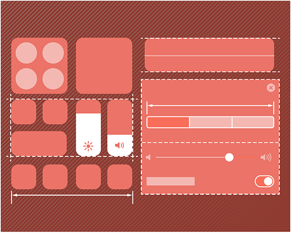
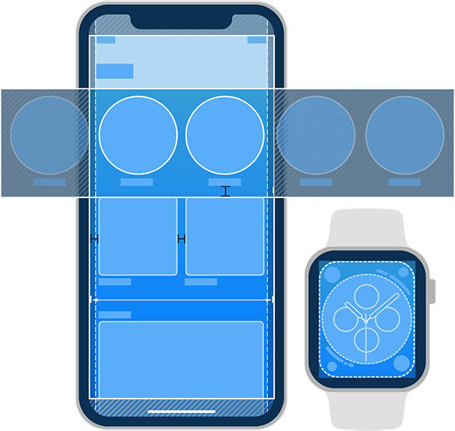

# SwiftUI Tutorials 한글 번역본

이 repository는 [Apple Developer의 SwiftUI Tutorials](https://developer.apple.com/tutorials/swiftui)를 번역한 내용입니다.

공식적으로 번역을 진행한 것이 아닌, 스터디 중 한글 번역이 없어 불편한 점을 해소하기 위해  
개인적으로 번역을 진행하다보니 오역이 있을 수 있습니다.

사용 중 `오역발견` 또는 `더 좋은 의역`에 대한 제안이 있을 시  
[sungyeop.choo@gmail.com](mailto:sungyeop.choo@gmail.com)로 제보해 주시거나,  
`fork -> 수정 -> PR`을 통해 수정내용에 대한 설명을 적어주시면  
함께 더 완성도 있는 자료로 발전시킬 수 있을 것이라 기대합니다.
  

# SwiftUI 소개

SwiftUI는 어떤 Apple 플랫폼에서든 UI를 현대적인 방법으로 선언할 수 있게 해줍니다.  
예쁘고 다이나믹한 앱들을 이전보다 빠르게 만들어보세요.

 예상 소요시간 **4시간 25분**

 

### [Getting Started (시작하기)]()

 

## Chapter 1. SwiftUI의 필수요소들

SwiftUI를 이용해 Xcode의 미리보기를 보면서 간단한 하나의 view부터 많은 view를 만드는 것, 데이터의 흐름을 설정하는 것, navigation을 구축하는 것을 배웁니다.

### - [view 만들고 합치기]() 40분

### - [list와 navigation 구축하기]() 35분

### - [user input 핸들링하기]() 20분

 

## Chapter 2. Drawing과 Animation

shape과 path를 그리는 방법과 이를 통해 view들 간의 원활한 transition을 적용할 badge를 만드는 방법을 알아봅니다.

### - [Path와 Shape 그리기]() 25분

### - [view에 animate와 transition 적용하기]() 20분

 

## Chapter 3. App Design과 Layout

SwiftUI를 이용해 structure와 layout 그리고 더 복잡한 인터페이스를 만드는 방법을 알아봅니다.

### - [복잡한 interface 작업]() 20분

### - [UI Control을 이용한 작업]() 25분

 

## Chapter 4. Framework 통합하기

특정 플랫폼의 UI 프레임워크를 사용하는 view및 view controller와 SwiftUI의 view를 함께 사용하는 방법을 알아봅니다.

### - [UIKit과의 interfacing]() 25분

### - [watchOS 앱 만들기]() 25분

### - [macOS 앱 만들기]() 30분

 
